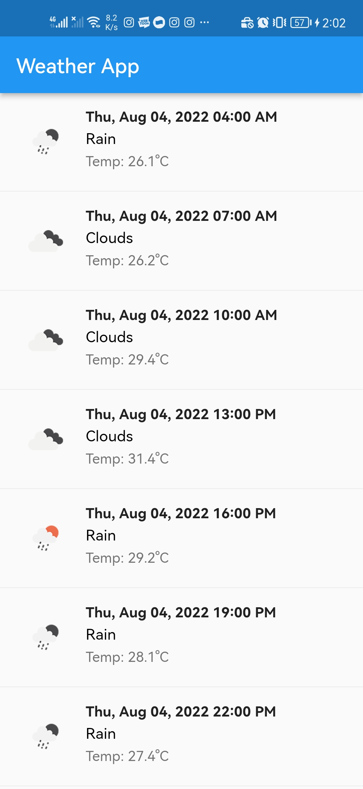
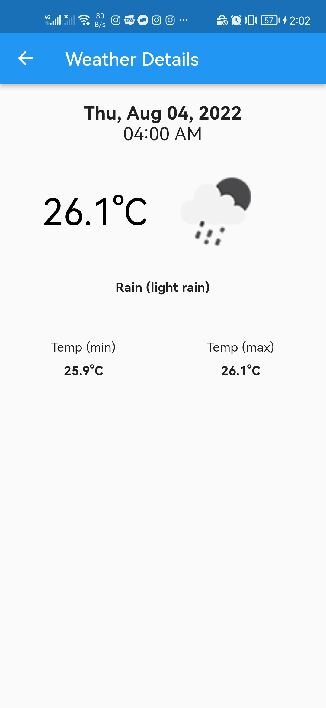

# Delos Weather App

A Weather Apps For Monas, Jakarta.

# Preview
 

# Getting Started
### Dependencies
 - Flutter 2.8.x statble
 - Dart 2.15.x
 - Get (GetX) 4.6.5
### To get started
 1. Clone the repo locally, via git clone https://github.com/odhier/delos-weather-app.git `<optional local path>`.
 2. Install the dependencies by running `flutter pub get`.
 3. Use command `flutter run` or `flutter run --release` to run the app on a connected device, or iOS simulator, or Android Emulator.

optional:
 - Run `fluter build apk` to get apk file

